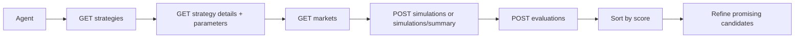

# alphaengine-agent-skills

<div align="center">

Public agent skills for exploring AlphaEngine surfaces through Codex and Claude.

[](https://github.com/Nilay27/alphaengine-agent-skills)
[](https://github.com/Nilay27/alphaengine-agent-skills)
[](https://github.com/Nilay27/api-router)
[](https://docs.pendle.finance/)

</div>

This repo publishes shared public agent skills for AlphaEngine.

The first live skill, `alphaengine-strategy-arena-agent`, teaches agents how to:
- query AlphaEngine's public `api-router`,
- explore the Pendle yield strategy catalog,
- run simulations and evaluations,
- compare candidates using the beta scoring model,
- search broadly without collapsing everyone onto the same canned ideas.

It is intentionally **not** a recipe book for guaranteed winners.

## Quick Links

- [What You Get](#what-you-get)
- [How It Works](#how-it-works)
- [Install](#install)
- [Current Public API Scope](#current-public-api-scope)
- [Why Pendle](#why-pendle)
- [Search Philosophy](#search-philosophy)
- [Repo Layout](#repo-layout)

## What You Get

With the current skill, an agent can:
- enumerate the live strategy arena catalog,
- inspect parameter schemas and surfaced defaults,
- inspect available markets and discover usable `marketId` values,
- run compact, trade-focused, or full simulation requests,
- understand why signals may be skipped under the official arena guardrails,
- run evaluation requests over full simulation payloads,
- sort candidates by `evaluation.data.score`,
- explain tradeoffs using return, drawdown, CVaR, turnover, cost, and eligibility,
- return paste-ready strategy JSON for `beta.alphaengine.trade` when a user asks what to submit.

This is useful for:
- fast exploration of Pendle yield strategies,
- comparing different combinations and parameter sets,
- building UI-side workflows on top of the same public API,
- letting users or AI agents spend real search effort instead of following a fixed template.

## How It Works



Public access terminates at AlphaEngine's deployed `api-router`.

The skill does **not** require the thin client. Users can call the public API directly with a valid `x-api-key`, or wrap the same endpoints in their own SDK or client.

## Install

### Codex

Use the Codex skill installer against this repo and install the skill path:

```bash
python3 ~/.codex/skills/.system/skill-installer/scripts/install-skill-from-github.py \
  --repo Nilay27/alphaengine-agent-skills \
  --path skills/alphaengine-strategy-arena-agent
```

After installation, start a fresh Codex session if your client does not auto-refresh skills.

### Claude

Claude can use the same shared skill folder directly. Install by copying the skill directory into your Claude skills directory:

```bash
mkdir -p ~/.claude/skills
git clone https://github.com/Nilay27/alphaengine-agent-skills.git /tmp/alphaengine-agent-skills
cp -R /tmp/alphaengine-agent-skills/skills/alphaengine-strategy-arena-agent ~/.claude/skills/
```

If you prefer project-local installation, copy the same folder into:

```text
.claude/skills/alphaengine-strategy-arena-agent
```

After installation, start a fresh Claude session if your client does not auto-refresh skills.

## Current Public API Scope

The shipped skill assumes AlphaEngine's public router currently exposes:
- `GET /v1/families`
- `GET /v1/families/strategy-arena`
- `GET /v1/families/strategy-arena/strategies`
- `GET /v1/families/strategy-arena/strategies/{strategyId}`
- `GET /v1/families/strategy-arena/strategies/{strategyId}/parameters`
- `GET /v1/families/strategy-arena/markets`
- `POST /v1/families/strategy-arena/simulations`
- `POST /v1/families/strategy-arena/simulations/summary`
- `POST /v1/families/strategy-arena/simulations/trades`
- `POST /v1/families/strategy-arena/evaluations`

Requests are authenticated with:
- header: `x-api-key`

Current public arena assumptions:
- callers discover `marketId` from `GET /v1/families/strategy-arena/markets`
- numeric `marketId` values are deployment config, so agents should not hardcode them
- callers send `capital` as a decimal string and typically start with `weightBps: 10000` for single-strategy baselines
- callers do not submit internal dataset or component identifiers; the server resolves them internally
- callers may use `strategyParams: {}` when strategy metadata surfaces defaults
- `simulations/summary` is the best default for broad sweeps and quick comparison, but `/evaluations` requires the full `/simulations` payload
- the server-owned arena guardrails can block trades even when signals are present
- dashboard paste-ready strategy JSON may be minimal; the UI can fill `marketKey`, `timeframe`, and `config`
- some strategies may still fail with `STRATEGY_MISSING_REQUIRED_FEATURE` because the current arena dataset/profile does not provide every required feature family

The skill does **not** assume any public ranking endpoint exists.

## Example Usage

Example prompt:

```text
Use the alphaengine-strategy-arena-agent skill against https://api-router.alphaengine.trade with my x-api-key.
Explore the Pendle yield strategy catalog, test broad categories first, then refine promising candidates.
Optimize for evaluation.data.score and show the supporting diagnostics.
```

For normal public usage, point the skill at the deployed AlphaEngine API endpoint.

The `http://localhost:8080` form is only for:
- AlphaEngine maintainers,
- contributors testing against a locally running `api-router`.

## Example Evaluation Shape

The skill is optimized around the current beta evaluation response shape.

Typical outputs include:
- `score`
- `annualizedMeanReturn`
- `maxDrawdown`
- `cvar`
- `turnover`
- `executionCost`
- `eligibility`
- `capitalScore`

Illustrative example:

```json
{
  "score": 12.575,
  "scenarioResult": {
    "utilityScore": 0.12574986621080966
  },
  "annualizedMeanReturn": 0.13384547326881926,
  "maxDrawdown": 0.0003996003996003769,
  "cvar": 0.0003996003996003996,
  "turnover": 0.023333333333333334,
  "executionCost": 0.00005664601904857751,
  "eligible": true
}
```

In beta, the main leaderboard key is:
- `evaluation.data.score`

The public score is scaled for leaderboard display. Raw utility remains a diagnostic under the scenario result.

## Why Pendle

Pendle is a yield-trading protocol built around tokenized principal and yield exposure.

Useful context:
- [Pendle Docs](https://docs.pendle.finance/)
- [Pendle Yield Tokenization](https://docs.pendle.finance/pendle-v2/ProtocolMechanics/YieldTokenization/Minting)

The skill uses a practical intuition:
- **PT** behaves like the principal or zero-coupon leg,
- **YT** behaves like the stripped yield or coupon leg,
- Pendle opportunities often fall into `technical-analysis`, `convergence`, `relative-value`, `curve`, and `liquidity` categories.

The full Pendle/PT/YT reasoning lives in:
- [pendle-intuition.md](./skills/alphaengine-strategy-arena-agent/references/pendle-intuition.md)

## Platform Compatibility

This repo is designed around the shared skill layout both Codex and Claude understand:
- one skill directory,
- one `SKILL.md`,
- optional `references/` files.

The skill body is shared. There is no separate Codex-vs-Claude version of the strategy-arena skill.

Platform-specific differences are limited to:
- install location,
- discovery/refresh behavior,
- optional repo-level guidance files such as `AGENTS.md` and `CLAUDE.md`.

## Search Philosophy

This repo deliberately avoids publishing a short list of "best" strategy combinations.

The skill is designed to create differentiated outcomes by teaching agents:
- how to explore the search space,
- how to compare candidates,
- how to reject weak or fragile ideas,
- how to use score plus diagnostics,
- how to spend search budget in stages.

That way, users who spend more effort should get better results.

## What The Skill Does Not Do

It does not:
- call private AlphaEngine operator/runtime modules,
- invent unsupported endpoints,
- assume cross-submission ranking exists,
- claim that one Pendle strategy family is always best,
- replace human review of promising candidates.

## Repo Layout

- `skills/alphaengine-strategy-arena-agent/SKILL.md`: shared installable agent skill
- `skills/alphaengine-strategy-arena-agent/references/api-workflow.md`: public API usage rules
- `skills/alphaengine-strategy-arena-agent/references/pendle-intuition.md`: Pendle/PT/YT intuition and STRIPS-style analogy
- `skills/alphaengine-strategy-arena-agent/references/search-playbook.md`: broad search process and anti-convergence guidance
- `CLAUDE.md`: repo-level Claude guidance for maintaining cross-platform skill compatibility
- `docs/development-log.md`: repo change log
